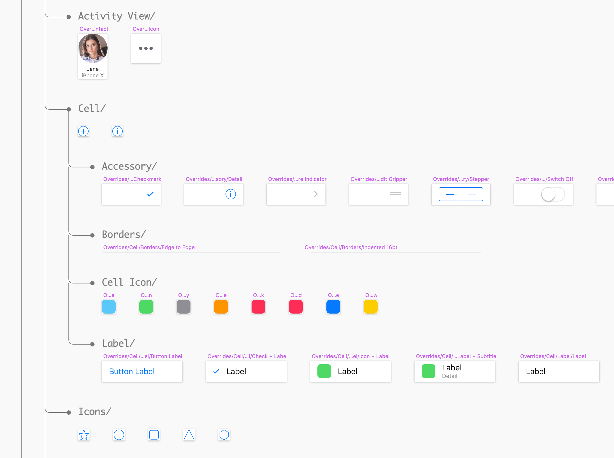
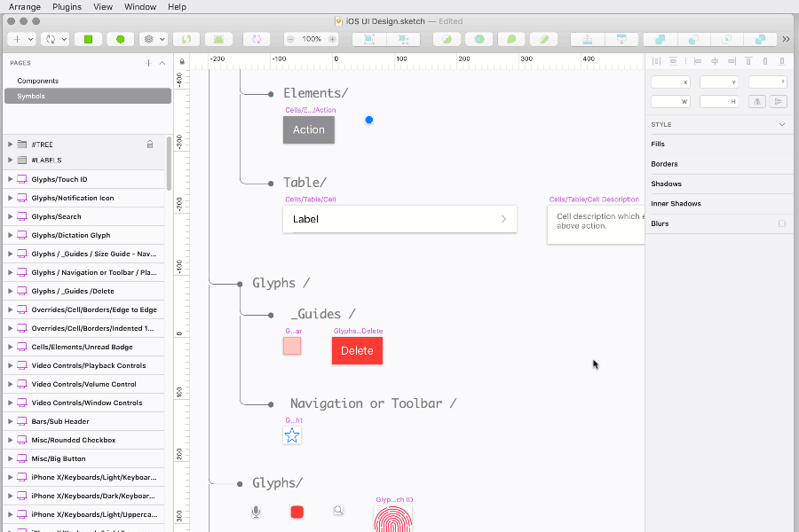

# Gabo Power Tools (GPT)

A small collection of handy tools for [Sketch](https://sketchapp.com/). Use at your own risk.

[Download](https://github.com/gabocorp/SketchGPT/releases/latest) the latest release of the plugin

It currently includes these four tools:

---

## 1. SymbolTree (Organize + Rename)
This tool organizes your Symbols page and simplifies management of symbol hierarchy.

### Usage
***Step 1.*** Run once in your *Symbols* page to automatically organize all your *symbols* by name and hierarchy.



***Step 2.*** Now you can rename your *symbols* by changing *group* label text or moving your *symbols* below desired label and **running the tool again**.



## Make Shared TextStyle Samples
 Makes a new artboard with samples and details for each *shared text style*.

## Export Shared TextStyles to JSON
 Makes a JSON file with all the shared text style data for easy parsing. Reading it is up to you.

Here's an example:
``` js
{
    "headerOnDarkC": {
        "styleName": "headerOnDarkC",
        "styleSketchName": "header/on-dark/C",
        "fontFamily": "Helvetica Neue LT Std",
        "fontWeightIndex": 9,
        "fontWeight": "75 Bold",
        "fontSystemName": "HelveticaNeueLTStd-Bd",
        "fontSize": 18,
        "lineHeight": 24,
        "alignment": "center",
        "textTransform": "none",
        "kerning": 0,
        "color": "#ffffffff",
        "colorName": "White"
    },
    "headerC": {
        "styleName": "headerC",
        "styleSketchName": "header/C",
        "fontFamily": "Helvetica Neue LT Std",
        "fontWeightIndex": 9,
        "fontWeight": "75 Bold",
        "fontSystemName": "HelveticaNeueLTStd-Bd",
        "fontSize": 18,
        "lineHeight": 24,
        "alignment": "center",
        "textTransform": "none",
        "kerning": -0.2,
        "color": "#000000ff",
        "colorName": "Black"
    }
}
```

## Select Next Instance
Quickly cycle through instances of symbols and styles throughout the document.

### Usage 

- **Select** any *symbol **instance*** and **run** to select the next instance of that symbol.
- **Select** any *layer* with a shared *style* and **run** to select the next layer with that *style*